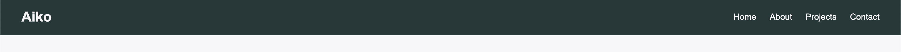
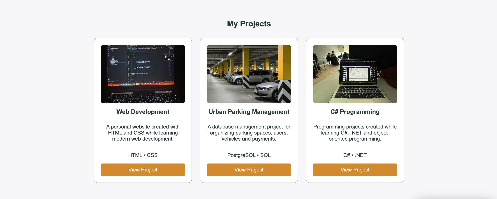
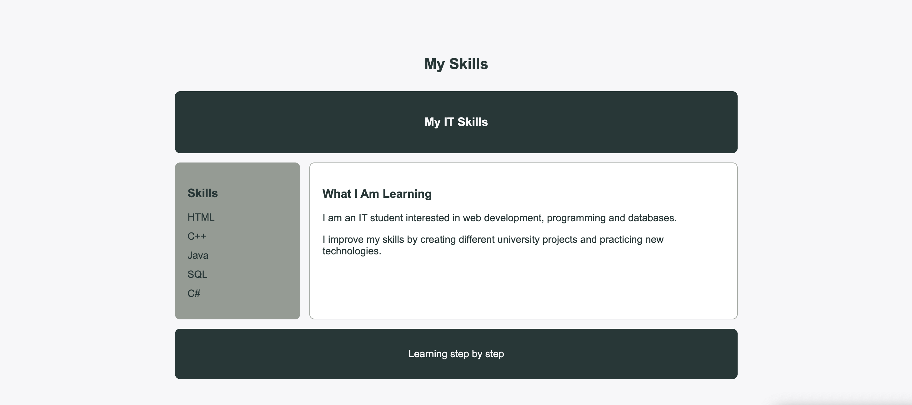
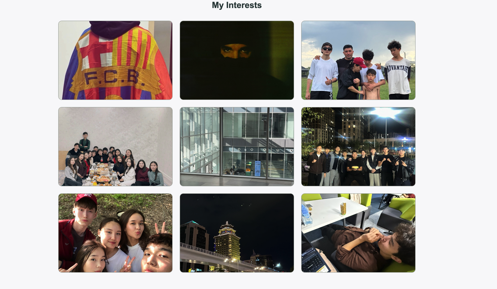
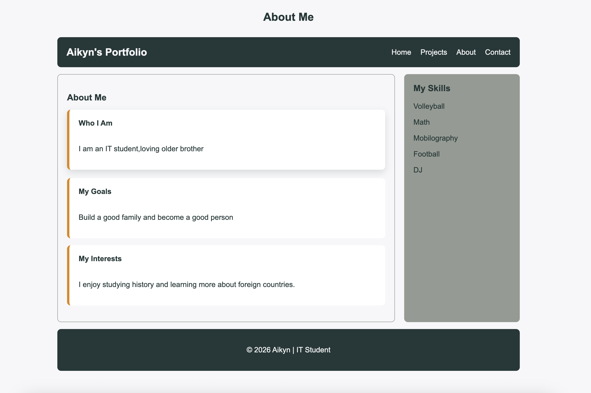

# Assignment #2 — Advanced CSS: Flexbox & Grid

Name: Aikyn Sabit
Group: IT-2504

## Task 0 — Navigation Bar

Created a navigation bar using Flexbox. The logo is placed on the left and the navigation links are placed on the right. Added spacing between the links and vertical alignment.

## Task 1 — Card Row

Created three project cards using Flexbox. Each card contains an image, title, description, technologies and a button. Added equal height, consistent gaps and hover effects.

## Task 2 — Page Layout with Grid Areas

Created a page layout using CSS Grid with a header, sidebar, main content and footer. Used grid-template-areas to organize the layout.

## Task 3 — Image Gallery

Created a 3×3 image gallery using CSS Grid. Added equal-sized images, consistent gaps and hover effects with captions.

## Task 4 — Portfolio

Created a personal portfolio layout using both CSS Grid and Flexbox. Added projects, personal information, skills, contact form and footer. The project pages also contain links to GitHub repositories.

## Summary

During this assignment, I practiced using Flexbox and CSS Grid to create responsive web layouts. I created a personal portfolio website with a navigation bar, project cards, grid layout, image gallery and portfolio section. I also added responsive styles for smaller screens and created separate pages for my projects.

## GitHub

https://github.com/aikynsabit077/assignment2WEB.git
## Link to Website
https://aikynsabit077.github.io/assignment2WEB/
